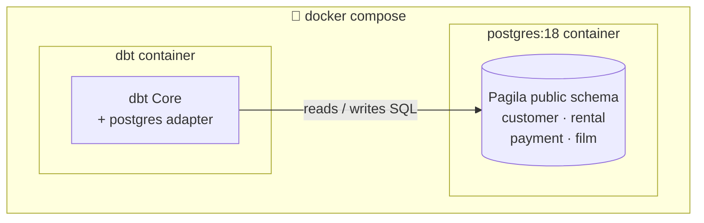
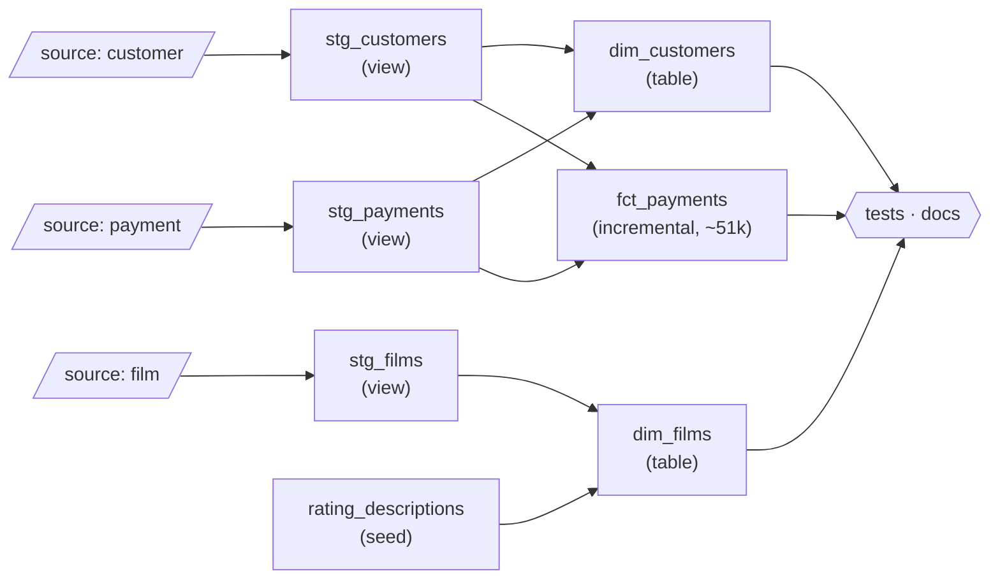

# dbt Core: The Brutalist Blueprint


A fully-runnable dbt project for a beginner data-engineering class, on real
public data: **[Pagila](https://github.com/devrimgunduz/pagila)** — the standard
Postgres sample database (a DVD-rental store, ~51k payments & rentals).
**Both Postgres and dbt Core run in Docker** — no local Python required.
Every step here maps to a **▶ LAB CHECKPOINT** in the slides.

> 📊 **Slides:** https://thosangs.github.io/dbt_lecture/  ·  brutalist × teal, diagram-driven

### The stack



### The model DAG (what dbt builds)



## The two containers

| Service | What it is |
|---|---|
| `postgres` | The warehouse (Postgres 18). Pagila is auto-loaded into `public` on first boot. Started by `docker compose up`. |
| `dbt` | dbt Core + the Postgres adapter, in its own image. Invoked on demand with `docker compose run` (it's behind a compose profile, so `up` doesn't start it). |

## 0. Bring up the stack

```bash
docker compose up -d          # build images + start Postgres

# drop into the dbt container — every dbt command runs in here:
docker compose run --rm --service-ports dbt bash
```

You are now inside the container. Run the labs below from this shell.
(One-off without a shell: `docker compose run --rm dbt dbt debug`.)

## 1. Module 02 — connect & first run

```bash
dbt debug                        # expect: "All checks passed!"
dbt run --select my_first_model
```

## 2. Module 03 — seeds, sources & materializations

```bash
dbt seed                                       # load rating_descriptions.csv
dbt run --select stg_customers dim_customers   # views + a dimension table
dbt run --select fct_payments                  # incremental: full build (~51k rows)
dbt run --select fct_payments                  # incremental: delta only (INSERT 0 0)
```

## 3. Module 04 — dynamic SQL (macro, hooks, vars)

```bash
dbt run --select stg_customers                 # uses the full_name() macro
dbt run --select dim_customers                 # +post-hook grants to "reporter"
dbt run --select fct_payments --vars '{"start_date": "2022-04-01"}'
```

## 4. Module 05 — trust: tests, history, docs

```bash
dbt test                          # generic + singular tests
dbt snapshot                      # SCD Type 2 history of customer.last_update
dbt build --select +fct_payments  # run + test the model and everything upstream
dbt docs generate && dbt docs serve --host 0.0.0.0   # lineage at http://localhost:8080
```

## Peek at the results (from your host, another terminal)

```bash
docker exec -it dbt_class_pg psql -U dbt -d analytics \
  -c "select * from dev.dim_customers order by lifetime_value desc limit 10;"
```

## Project layout

```
docker-compose.yml     postgres + dbt services
docker/init/           01_setup.sql + Pagila dump -> loaded into public (dbt SOURCES)
docker/dbt/Dockerfile  the dbt Core + Postgres adapter image
dbt_project.yml        project config (paths, vars, post-hook, materializations)
profiles.yml           connection; host is env-driven (container vs local)
seeds/                 rating_descriptions.csv (a tiny static lookup)
models/
  example/             my_first_model.sql  (hello world, table)
  staging/             stg_customers/payments/rentals/films (views) + _staging.yml
  marts/               dim_customers, dim_films (tables), fct_payments (incremental)
macros/                full_name.sql
snapshots/             customers_snapshot.sql (SCD Type 2 on last_update)
tests/                 assert_fct_payments_amount_positive.sql (singular test)
slides/                the lecture deck (Slidev)
```

## Reset / teardown

```bash
docker compose down             # stop everything (keeps data volume)
docker compose down -v          # stop + wipe data (fresh raw layer next boot)
```

## Optional: run dbt on your host instead of in Docker

`profiles.yml` reads `DBT_HOST` (defaults to `localhost`), so a host install works too:

```bash
uv venv --python 3.11 && uv pip install -r requirements.txt
source .venv/bin/activate
export DBT_PROFILES_DIR=$(pwd)
docker compose up -d postgres   # just the DB
dbt debug
```
